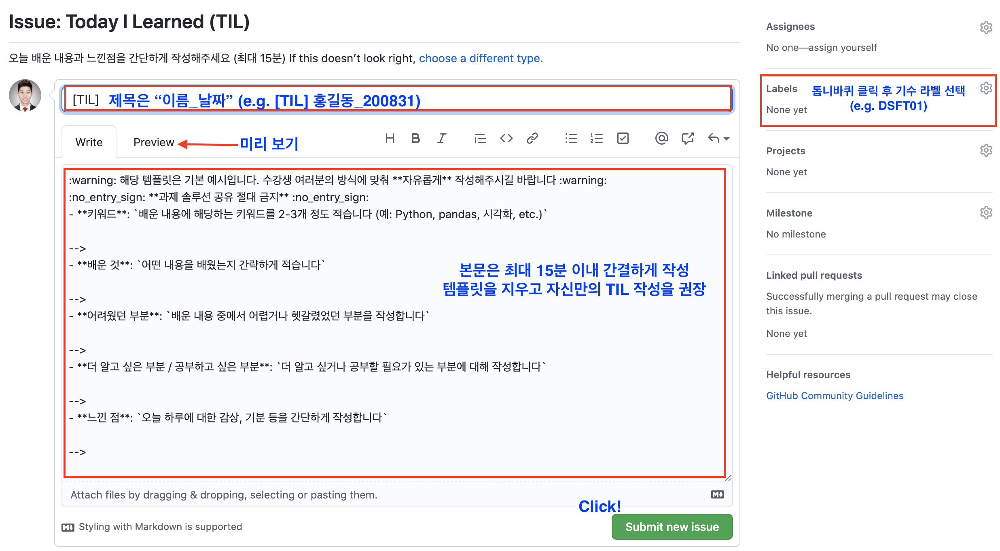

# Data Science Today I Learned

## :pencil: Data Science TIL 페이지에 오신 것을 환영합니다 :pencil:

`DS-TIL` 은 여러분들의 오늘 하루 동안 배운 내용, `TIL`을 자유롭게 공유하는 공간입니다.

**짧고 간단히, 그리고 자유로운 형식으로**, 오늘 내가 이런 것들을 배웠구나를 간단하게 정리할 수 있으면 좋겠어요 ~~

## :information_source: TIL 작성 방법 :information_source:

1. 왼쪽 위 ! `Issues`로 들어간 다음
2. 오른쪽 위 ! 초록색 [New Issue](https://github.com/codestates/ds-TIL/issues/new/choose) 버튼을 눌러, `TIL`을 작성할 수 있습니다.
3. 간단한 markdown 문법은 [UrClass](https://urclass.codestates.com/)의 `DS Docs`(**Markdown Syntax Cheatsheet**)에서 참조할 수 있습니다.

## :bookmark_tabs: 작성 예시 :bookmark_tabs:

- 다른 수강생분들의 `TIL`도 읽어보고, 댓글로 함께 커뮤니케이션하면 모두에게 도움이 될 거에요.
- 다 읽고 난 이후에는 **따봉**을 눌러주는 센스 ~ !

## :warning: 주의 :warning:

- `TIL`은 매일 작성을 권장합니다 ! (Today I Learned!), 물론, 내용이 반드시 유익하거나 거창할 필요는 없습니다. 가장 중요한건 **꾸준함** 이니까요.
- `TIL`은 여러분이 자유롭게 형식이나 내용에 얽매이지 않고 **간단하게** 작성하시면 됩니다. (그렇지만 이왕이면 짧게 짧게 !)
- `TIL`에 기본으로 설정되어 있는 템플릿은 `TIL`을 처음 접하시는 분들을 위한 가이드라인으로, 템플릿 사용이 필수는 아닙니다. ( 없는게 더 좋아요 ! :grin: )

- 그러나, 어떠한 방식이든, **과제에 대한 솔루션을 작성하는 것**은 **절대 금지**합니다 🚫 
- 이는 여러분의 동료, 더 나아가 후배들이 노력, 성장 할 수 있는 기회를 빼앗는 매우 이기적인 행동임을 유의해주세요.

- 이 `TIL` repository의 내용은 여러분과, CodeStates뿐 아니라 전세계의 모두에게 `public`하게 오픈됩니다.
- 즉, 내용을 작성할 때, 1차적으로는 **여러분과 여러분의 동료가 읽는다**는 것을 기억해주시고,
- 더 나아가, **여러분이 앞으로 함께 하게 될 사람들과 DS 코스의 후배들 또한 여러분이 남긴 노력의 발자취를 따라올 수 있다**는 것도 기억해주세요.

이 외에 제안이나 같이 알아야 할 이슈가 생기면 언제든지 [DS Help Desk](https://github.com/codestates/help-desk-ds)를 통해 알려주세요.

## ⭐ 감사합니다 ! ⭐
